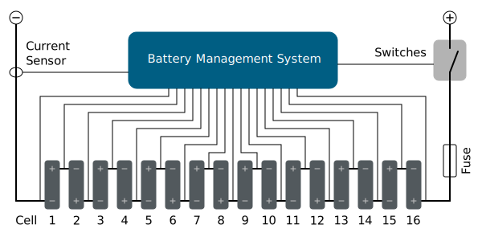

# System Description

This chapter gives a high-level introduction into the battery management system that is going to be developed within this project.

## BMS topology

The BMS will follow the centralized topology approach where a single unit includes pack-level and cell-level measurement and protection functions. The C in the name stands for centralized / compact.

A schematic diagram of the centralized topology is shown in below figure.

This topology was chosen because it provides the cheapest and most simple solution for the number of cells required for a pack voltage of up to 48 V nominal.

### Considered alternatives

Alternative distributed and modular BMS topologies are further described on [learn.libre.solar](https://learn.libre.solar/system/bms.html).

For up to 16s cells a modular topology is not required. Separating the main BMS control board from the module controller would only increase cost and complexity because of the galvanically isolated communication. A modular BMS makes most sense for high-voltage batteries (e.g. in electric vehicles) beyond 48 V.

The distributed topology is not considered feasible either, as it requires a single PCB with a dedicated microcontroller or ASIC for each cell. While this approach might work for comparably large cells, smaller battery packs would not have enough space to fit these PCBs. In addition to that, one single centralized board is considered more cost-effective.

## System integration

The BMS boards will be integrated into a battery system with its own enclosure. It will have a plastic enclosure to protect the circuit during assembly (e.g. against short circuits by tools) and to allow fixation inside the battery together with a heat sink.

## External interfaces

The BMS will contain communiation interfaces for monitoring, control and higher-level energy management.

For fast control tasks between different devices in an energy system (e.g. multiple batteries in parallel), a CAN bus will be used.

In order to implement remote monitoring and PAYG business models, the BMS can be extended with radio communication, e.g. via GSM or LoRa. The microcontroller will be powerful enough to extend the firmware depending on individual needs. The hardware will provide extension ports to allow communication with the microcontroller, as described below in further detail.
